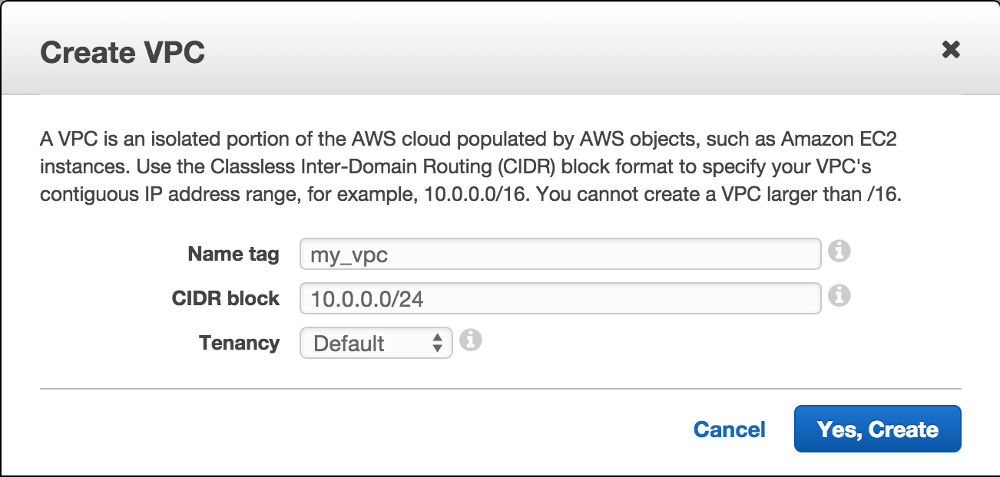
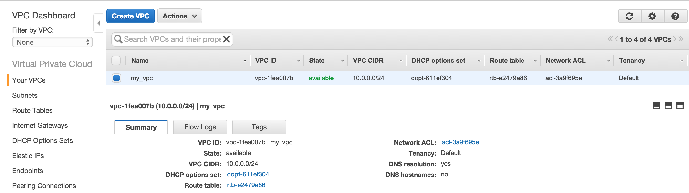
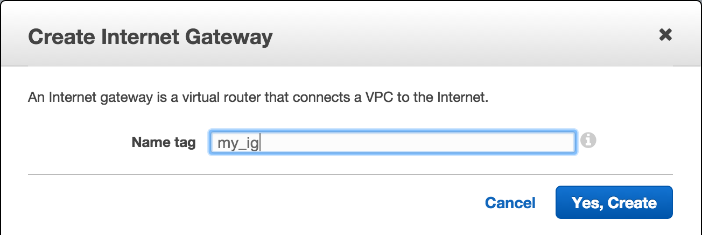
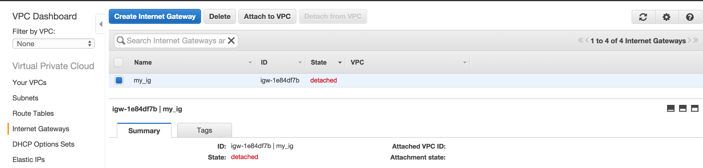
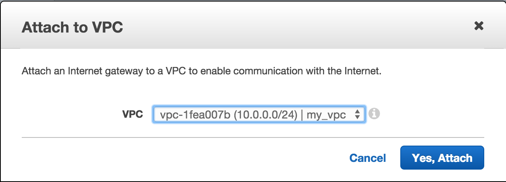
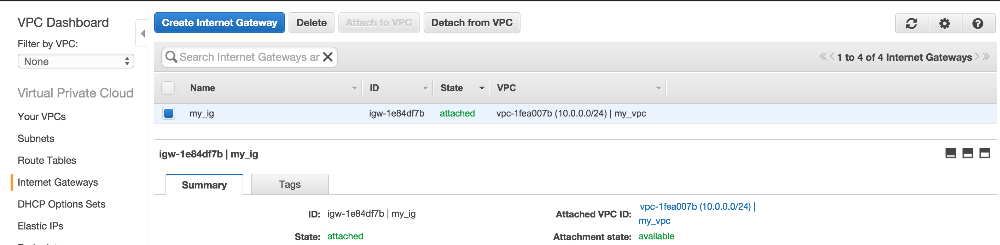
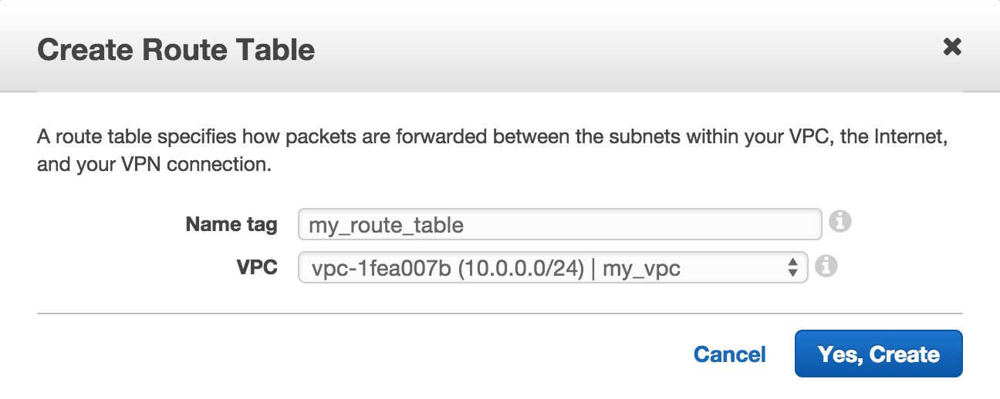

# Setup VPC to Work with Packer

Packer works in AWS by spinning up an instance in your AWS account, configuring that instance, then creating an AMI from it which can be stored as an artifact in Atlas.

In order to do this, Packer only needs your AWS credentials, everything else is done in the Packer template. However, there can be an issue SSH'ing in to the instance that was created depending on how your AWS setup is configured. You may see a Packer build error similar to `amazon-ebs: Timeout waiting for SSH.`.

If you have an [AWS EC2-Classic account](http://docs.aws.amazon.com/AWSEC2/latest/UserGuide/using-vpc.html#differences-ec2-classic-vpc) (created after 12/04/2013), or will be launching these instances into a VPC, there are a few steps below you'll want to follow.

The Amazon links in these steps will refer to a VPC in the us-east-1 region. There are 2 main parts, the [Networking](#networking) and the [Packer template](#packer-template-setup).

### Networking

Below are steps to ensure your networking in AWS is setup to allow Packer to SSH into instances created in your VPC. If you already have one or all of these components, there is no need to re-create, just verify each piece exists. If one or more of these components do not exist, use the [Terraform network module](../metamon/ops/terraform/network) to setup a complete VPC for you.

1. [Create a VPC](https://console.aws.amazon.com/vpc/home?region=us-east-1#vpcs:) with the CIDR block of your choice, we'll use `10.0.0.0/24`

   

   You should see your new VPC

   
1. [Create an Internet Gateway](https://console.aws.amazon.com/vpc/home?region=us-east-1#igws:)

   

   You should see your new Internet Gateway

   
1. [Attach Internet Gateway to VPC](https://console.aws.amazon.com/vpc/home?region=us-east-1#igws:)

   

   You see see your attached Internet Gateway

   
1. [Create Route Table](https://console.aws.amazon.com/vpc/home?region=us-east-1#routetables:)

   
1. [Add Route to Route Table](https://console.aws.amazon.com/vpc/home?region=us-east-1#routetables:) with a destination of `0.0.0.0/0`

   
1. [Add Subnet](https://console.aws.amazon.com/vpc/home?region=us-east-1#subnets:) with a CIDR block of your choice, we'll use `10.0.0.0/24`

   

   You should see your new Subnet

   
1. [Associate Subnet with Route Table](https://console.aws.amazon.com/vpc/home?region=us-east-1#subnets:)

   

### Packer Template Setup

If you're using an AWS EC2-Classic account, or launching Packer instances in a VPC, you'll need to add a few things to your Packer template.

Add the `vpc_id` and `subnet_id` you just created (or grab your existing). In our case it was a vpc\_id of `vpc-1fea007b` and a `subnet_id` of `subnet-8f1e5ba4`. You'll also want to set `ssh_private_ip` to `false` and `associate_public_ip_address` to `true`. See the below example Packer `amazon-ebs` builder.

```
"builders": [{
    "type": "amazon-ebs",
    "access_key": "{{user `aws_access_key`}}",
    "secret_key": "{{user `aws_secret_key`}}",
    "region": "us-east-1",
    "vpc_id": "vpc-1fea007b",
    "subnet_id": "subnet-8f1e5ba4",
    "ssh_username": "{{user `ssh_username`}}",
    "ssh_private_ip": false,
    "associate_public_ip_address": true,
    "instance_type": "t2.micro",
    "source_ami": "ami-9a562df2",
    "ami_name": "test {{timestamp}}",
    "ami_description": "Test AMI",
    "run_tags": {
        "ami-create": "test"
    },
    "tags": {
        "ami": "test"
    }
}],
```
